[](https://progetto-cmepda.readthedocs.io/en/latest) [](https://circleci.com/gh/LauraToni/Progetto_cmepda)


# Progetto_cmepda
This repository belongs to Laura Toni and Maria Irene Tenerani.
It contains our project exam for the course of Computing Methods for Experimental Physics and Data Analysis.

The aim of our project is to implement a convolutional neural network to classify grey matter image segments obtained from the brain MRIs of a cohort of subjects with Alzheimer’s disease and control.
Applying transfer learning we also used the pre-trained CNN layers to predict the age and the mini mental test score of the subjects.

## How to use

To use our Python codes the following packages are needed: numpy, scikit-image, scikit-learn, pandas, matplotlib, tensorflow, nibabel, random, seaborn and scipy.

### Step 1: Data

After cloning the repository, download the folder AD_CTRL from https://drive.google.com/drive/folders/1kKl1rOiU5eNDtKcTV4DAbwsDm83yyMIa
and add it to the directory Progetto_cmepda. This dataset contains the segmented grey matter of 189 healthy subjects (CTRL) and 144 subjects affected by Alzheimer’s Disease (AD).

### Step 2: Prepocessing

Run the MATLAB code Processing.m to cut the original images into volumes of 50x50x50 containing the hippocampus (saved in AD_ROI_TH and CTRL_ROI_TH) and a region of the brain that doesn't contain it (saved in AD_ROI_VOID and CTRL_ROI_VOID). The following figures show the regions chosen to enclosing the hippocampus and the void region respectively.

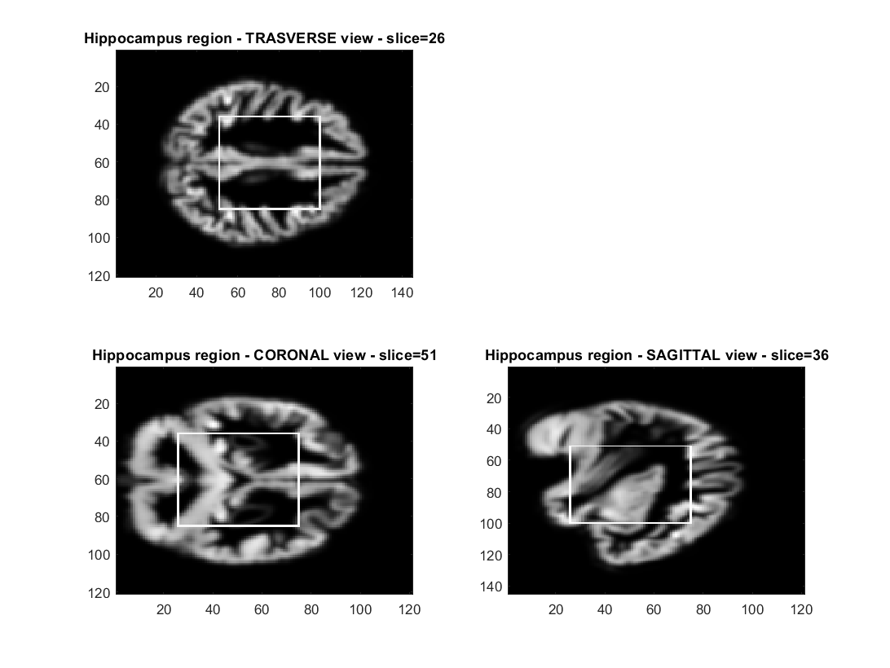  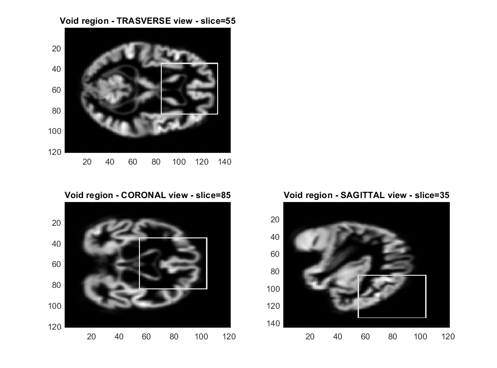

This code also creates volumes of 100x120x100 (saved in AD_ROI_LARGE and CTRL_ROI_LARGE) and 100x100x100 (saved in AD_ROI_TOTAL and CTRL_ROI_TOTAL) containing the whole brain MRIs images without the black borders.

  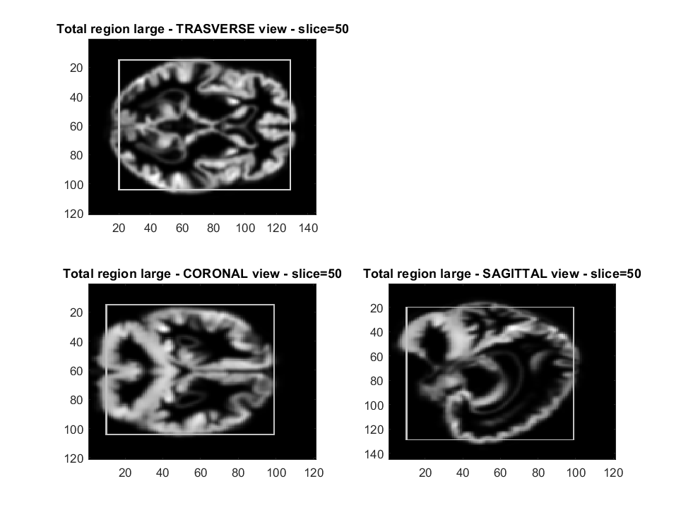


### Step 3: CNN model

Run the Python code CNN.py to create and train the convolutional neural network on the images in AD_ROI_TH/ and CTRL_ROI_TH/. The model will be saved in the file 3d_CNN_Hipp_finale.h5 and the wheights will be saved in CNN_weights_Hipp_finale.h5. The loss and the ROC will be displayed at the end of the train.

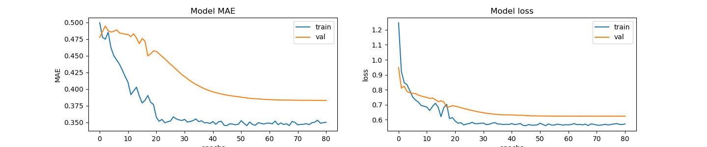   


### Step 4: Transfer learning to predict mmse and age

Run the codes CNN_regression.py to implement transfer learning and use the pre-trained CNN layers to predict the age and the mmse.
This code implements the transfer learning three times, first on the age of AD and CTRL images, secondly for the mmse of AD and CTRL images and lastly on the age of CTRL images only. 
The loss of the regression model will be displayed at the end of the train.

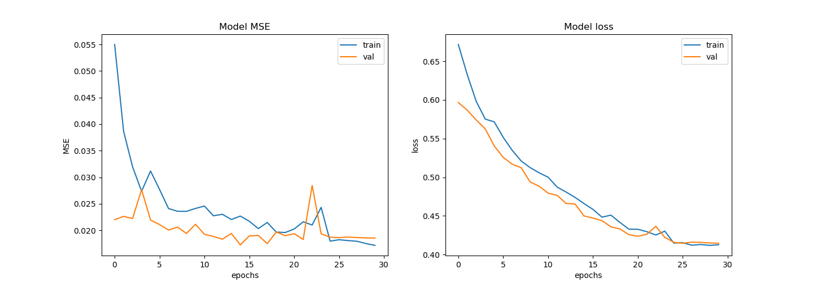 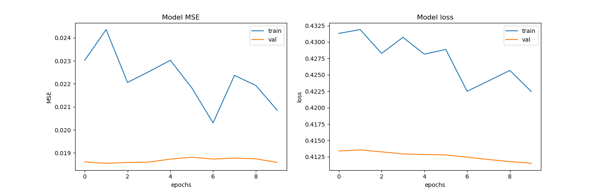  

### Step 5: Statistics analysis

Run the Python code statistics.py to study the previous results. For the classification problem it displays the cross validation k-folding ROC, the correlation between features such as age and mmse and the permutation test on the features.

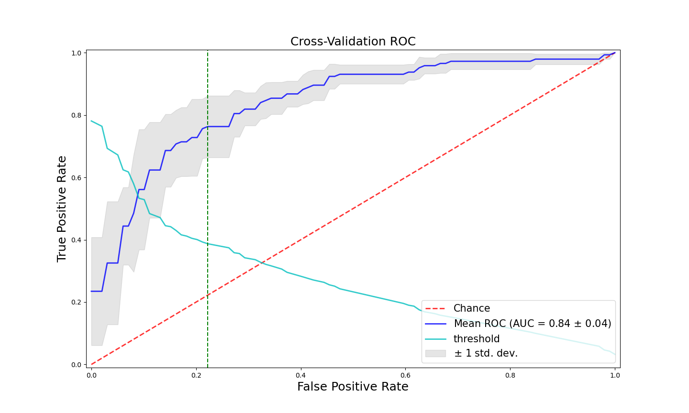   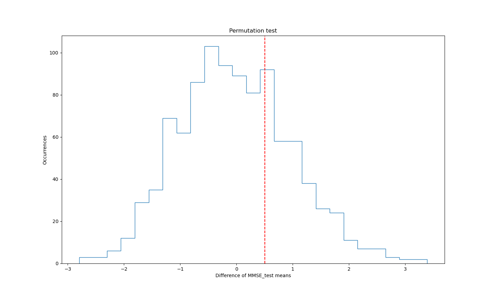

For the transfer learning problem this code also shows the scatter plots.

 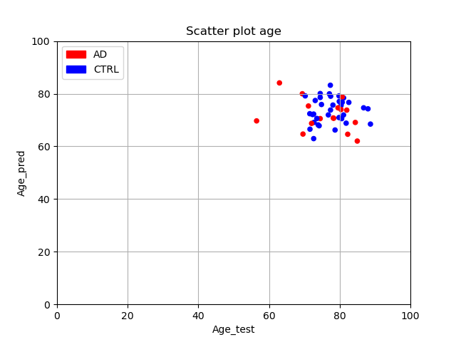
 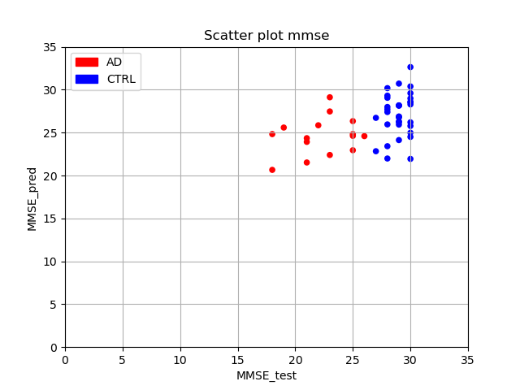

### Step 6: Void region

To show that the main information on the Alzheimer's disease can be extracted from the hippocampus region, run again Steps 3 to 5 on the images contained in AD_ROI_VOID/ and CTRL_ROI_VOID/. Just change the dataset path in the python codes as follows:

```
int __name__=='__main__':
dataset_path_AD_ROI = "AD_CTRL/AD_ROI_VOID"
dataset_path_CTRL_ROI = "AD_CTRL/CTRL_ROI_VOID"
```  
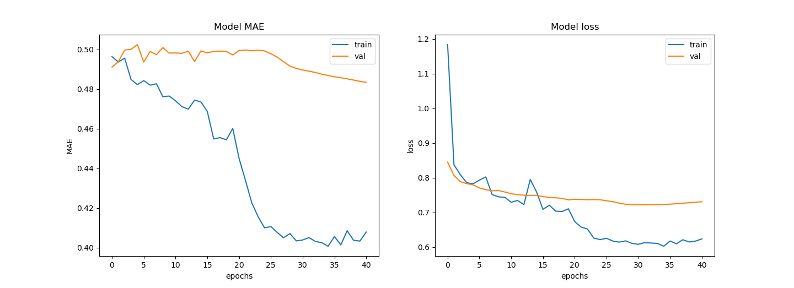   
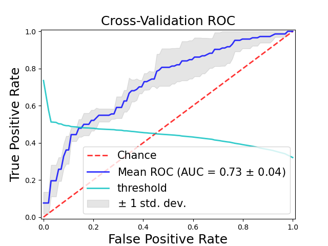     
